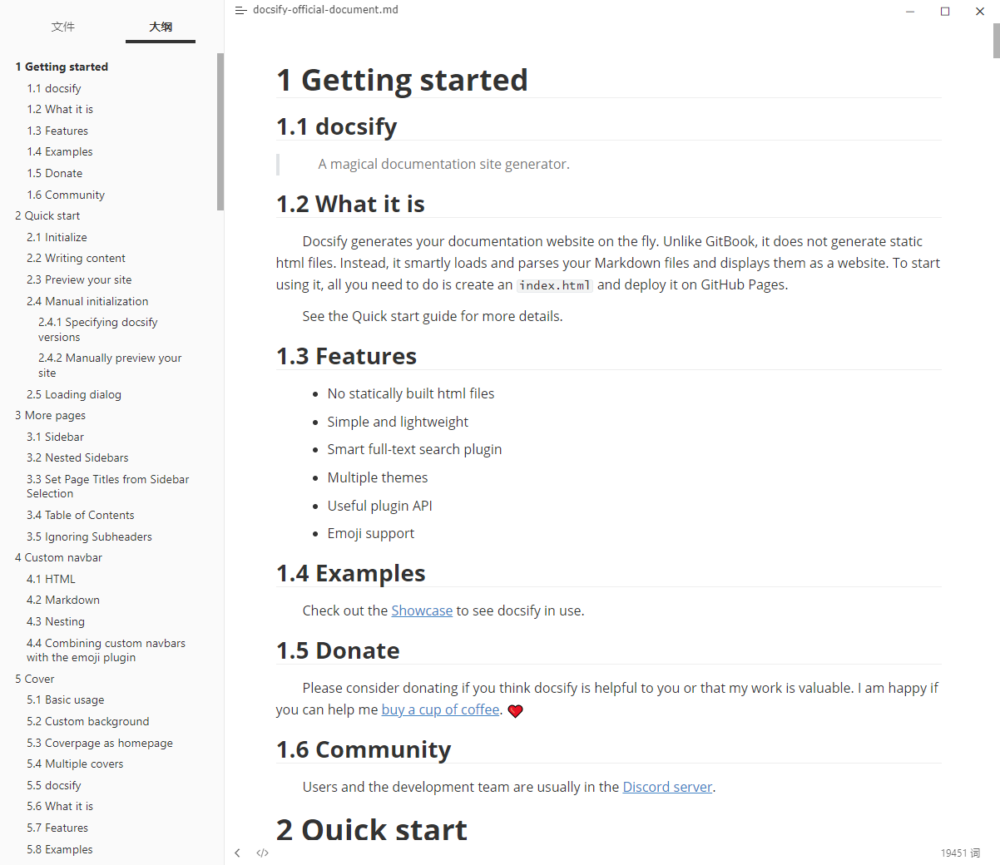

# <div align="center">Docsify Merger</div>

<div align="center">
  
  
  
  
</div>

<div align="center">
    <a href="README.md">English</a> | <a href="#">中文</a>
</div>

## 1. 简介

Docsify Merger 是一款将多个Markdown文档合并为一个文档的工具。
它能够根据 "_sidebar.md" 文件所定义的文档结构，重新合并为单一的Markdown文档。
该工具具有以下特点：

- 维持原有的层级关系：根据“_sidebar.md”文件中的层级关系合并多个Markdown文档
- 统一标题编号：去掉原来的标题编号，并重新给标题编号
- 去除内链：文档中指向其他标题的链接将会被去除，以免导出的Markdown文档出现链接路径不存在的情况
- 高度自定义：自定义标题删除的正则表达式，自定义标题生成规则
- 较高容错率：提供可选的未处理标题和大于六级标题的策略

之后你可以将导出的Markdown文档转换为PDF、Word、HTML、PNG等格式。
你可以使用[Pandoc](https://pandoc.org/)或者[Typora](https://typora.io/)来完成这一步。

下图为导出 [Docsify官方文档](https://docsify.js.org) 的效果：

<div align="center">

  <div>原始文档</div>
  <div>左：文档预览；中：docs目录结构；右：_sidebar.md内容</div>


</div>


<div align="center">

  <div>合并后的文档</div>



</div>

## 2. 使用方法

### 2.1 Python

如果你的电脑上已经安装了Python，那么你可以直接使用Python运行Docsify Merger

在命令行中输入以下命令，即可运行Docsify Merger

```shell
python docsify-merger.py
```

除此之外，你可以打开`docsify-merger.py`文件，修改`main`函数中的各个参数的值。

### 2.2 可执行文件

如果你的电脑上没有安装Python，那么你可以使用可执行文件运行Docsify Merger

下载`docsify-merger.zip`文件，解压后执行`docsify-merger.exe`即可。

但一般情况下，你可能需要修改一些配置，下面给出所有参数和建议值：

- Docsify项目根目录的路径: `-d ./doc`
- Docsify主页的路径: `-p ./README.md`
- 标题序号移除规则的配置文件路径: `-r ./config/serial_number_remove_config.json`
- 标题序号生成规则的配置文件路径: `-g ./config/serial_number_generate_config.json`
- 输出文件的路径: `-o ./mergerd.md`
- 未处理标题的策略: `-hu normal`
- 大于六级标题的策略: `-hg cite`

## 3. 配置项解释

对于exe文件，你可以在`config`文件夹中找到配置文件。而对于Python执行`docsify-merger.py`，你可以直接修改`main`函数中的各个参数的值。

### 3.1 对于路径参数的处理

对于路径参数，你可以使用相对路径或者绝对路径。如果你使用相对路径，那么相对路径的起点是`docsify-merger.exe`文件所在的目录。

特别的，Docsify主页的路径是相对于Docsify项目根目录的路径，即如果参数为`-d ./doc -p ./README.md`，那么Docsify主页的路径为`./doc/README.md`。

### 3.2 标题序号移除规则的配置文件

该配置文件是一个JSON文件，其中包含一个数组，数组中的每一个元素都是一个正则表达式，用于匹配标题序号。
如果标题序号匹配上了其中的一个正则表达式，那么该标题序号将会被移除。

另外，如果标题序号匹配到了多个正则表达式，那么将会去掉匹配到最长的那个序号。
例如对于`^\d+.`和`^(\d+.)+`这两个正则表达式，
如果标题序号为`1.1.`，那么根据第一个会匹配到`1.`，根据第二个会匹配到`1.1.`。
由于第二个标题序号更长，因此会去掉`1.1.`。

下面给出配置参数的默认值：

```json
[
  "^(\\d+\\.)+",
  "^\\d+[\\.\\d+]*",
  "^第[零一二三四五六七八九十]+(章|节|小节|讲|部分)",
  "^[\\(\\[\\{]?[a-zA-Z0-9]+[\\)\\]\\}]"
]
```

### 3.3 标题序号生成规则的配置文件

该配置文件是一个JSON文件，其中包含一个数组，数组中的每一个元素都是标题生成规则的配置项。其中第一个元素对应一级标题，第二个元素对应二级标题，以此类推。

每一个标题生成规则的配置项都包含以下参数：

- `prefix`: 标题前缀
- `suffix`: 标题后缀
- `remove_last_suffix`: 如果该标题序号到此级别结束，是否去掉后缀
- `independent`: 是否独立编号，如果为`true`，则该标题的编号前不会加上上一级标题的编号
- `serial_number_type`: 编号类型，可选值为 [`"number"`, `"roman_lower_case"`, `"roman_upper_case"`,
  `"alphabet_lower_case"`, `"alphabet_upper_case"`, `"chinese_lower_case"`, `"chinese_upper_case"`]
- `start_index`: 编号起始值

下面给出配置参数的默认值：

```json
[
  {
    "prefix": "",
    "suffix": ".",
    "remove_last_suffix": false,
    "independent": true,
    "serial_number_type": "number",
    "start_index": 1
  },
  {
    "prefix": "",
    "suffix": ".",
    "remove_last_suffix": true,
    "independent": false,
    "serial_number_type": "number",
    "start_index": 1
  },
  {
    "prefix": "",
    "suffix": ".",
    "remove_last_suffix": true,
    "independent": false,
    "serial_number_type": "number",
    "start_index": 1
  },
  {
    "prefix": "",
    "suffix": ".",
    "remove_last_suffix": true,
    "independent": false,
    "serial_number_type": "number",
    "start_index": 1
  },
  {
    "prefix": "(",
    "suffix": ")",
    "remove_last_suffix": false,
    "independent": true,
    "serial_number_type": "alphabet_lower_case",
    "start_index": 1
  },
  {
    "prefix": "",
    "suffix": ")",
    "remove_last_suffix": false,
    "independent": true,
    "serial_number_type": "roman_lower_case",
    "start_index": 1
  }
]
```

### 3.4 未处理与大于六级的标题处理策略

标题处理策略可选项如下（假设待处理的标题级别为`##`，标题为`二级标题`）：

- `normal`: 保留级别与标题，如 `## 二级标题`
- `title`: 只保留标题，如 `二级标题`
- `cite`: 只保留标题，并置为引用格式，如 `\n> 二级标题\n`。这里换行是为了避免污染上下文

### 3.5 应用程序配置

该应用程序将从`./config/application_config.json`读取应用程序配置，请勿删除或移动该文件。

该配置文件包含以下参数：

- `language`: 语言，可选值为 [`"en"`, `"zh"`]
- `logging_config_file_path`: 日志配置文件路径，如果是相对路径，那么将会从相对于`docsify-merger.exe`文件所在的目录读取日志配置文件

```json
{
  "language": "zh",
  "logging_config_file_path": "./config/logging_config.ini"
}
```

## 4. 未来计划

- [ ] 添加更多的标题生成规则可选项
- [ ] 添加更多的标题处理策略可选项
- [ ] 支持在线 Markdown 文档
- [ ] GUI界面

## 5. License

项目采用[Apache License 2.0开源协议](https://apache.org/licenses/LICENSE-2.0.txt)

Copyright © 2023 Jiang Liu.